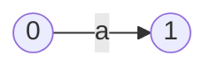
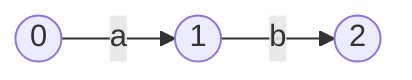

# Understanding Parsing 

언어를 완전하게 이해하는 건 아직 완성되지 않았다. 컴퓨터 언어를 파싱하고 코드를 생성하고 최적화 하는 과정으로서 컴파일러의 이해는 상당한 수준에 도달했다. C++과 같이 언어 자체가 컴파일 타임 계산을 추가하면서 복잡해져서 컴파일러가 해야 할 일이 늘어났다. 이런 부분을 제외한다면 실행 코드의 생성을 최종 목표로 하는 컴파일러 기술은 거의 완성되었다. 

컴파일러 이해를 위한 기초인 언어, 오토마타, 파싱 과정을 짧게 살펴본다. 현실적인 목표는 C++에 최적화된 메세지 IDL의 파싱과 C++/C# 코드 생성에 있다. 

## 자료 

Notes on Formal Language Theory and Parsing by James Power at National University of Ireland 자료로 진행한다.  설명이 부족하거나 이해가 안 되면 추가 자료를 찾아서 진행한다. 


#Regular Languages

10 페이지,  Automata 포함 

Lexical analysis, aka., scanning, is the processing getting tokens (words). 

Common words: 

- keywords
- operators 
- special symbols
- constants, string literals
- variable and function names (identifiers)

Tasks:

- token (a suitable representation for next stage processing)
- case 
- validation 
- eliminate irrelevant characters

## Regular Expressions

regex are used to define patterns of characters. 

regular expressions over an alphabet $\Sigma$ : 

- empty string $\epsilon$ 
- any character in $\Sigma$ 
- **union** operator | (disjunction, or) 
  - a | b = { "a", "b" }
- **concatenation** 
  - ab = {"ab"}
- **Kleene closure**, denoted by * 
  - a* = { $\epsilon$, "a", "aa", "aaa", ... }

알파벳과 $\epsilon$에서 union, concatenation, *로 만들어지는 집합이 regex이다. 

## Non-Deterministic Finite State Automata

regex를 판별하는 기계로서 NFA를 살핀다.  NFA를 거쳐 DFA를 만드는 흐름을 찾는다. 

$$ regex \longleftrightarrow NFA \longleftrightarrow  DFA$$ 

 NFA는 다음으로 구성된다: 

- 입력 심벌을 만드는 alphabet 집합 $\Sigma$ 
- states 집합 
  - a unique start state, usually numbered 0
  - a set of final states 
- a transition relation $T: State \times  Symbol  \rightarrow State$ 

상태를 원으로 전환을 화살표로 하는 그림으로 NFA를 표현할 수 있다. 


NFA는 다음과 같이 동작한다: 

- 시작 상태에서 첫 캐릭터 입력을 받는다. 
- 한 상태에서 캐릭터 입력을 받고 현재 상태에서 전환할 상태를 판단한다. 
  - 전환이 여러 개 있으면 임의로 하나를 선택한다 
  - $\epsilon$으로 표시된 전환이 있으면 입력을 사용하지 않고 전환할 수 있다 
- 입력이 없거나 최종 상태에 도달할 때까지 진행한다 
- 최종 상태에서 입력이 더 이상 없으면 패턴을 찾은 것이다. 
- 입력이 더 있다면 이전의 상태로 간 후 (backtrack) 이전에 선택하지 않은 상태로 전환한다 

여기서 핵심 개념은 모든 NFA는 regex에 해당한다는 점이다. *every NFA corresponds to a regular expression*


###Converting a regular expression to a NFA - Thompson's Algorithm 

1. 빈 문자열 ($\epsilon$)을 나타내는 NFA 

   ```mermaid
   graph LR 
   start((0)) --> finish((1))
   ```

2. 임의의 문자




3. union 

   ```mermaid
   graph LR 

   start((0)) -- a --> finish((1))
   start((0)) -- b --> finish((1))

   ```

   ​

4. concatenation 



5. Kleene closure 

 ```mermaid
graph LR 
start((0)) --> one((1))
one((1)) --a-->two((2))
two((2)) --e-->one((1))
two((2)) --e-->three((3))
start((0)) --e-->three((3))
 ```

### Kleene 정리 

The equivalence of NFA and regex. 

#### Kleene's Theorem Part 1: To each regex, there is a NFA. 

Boring 하다고 하는데 연습 문제로 푸는 게 좋을 듯 하다. 

#### Kleene's Theorem Part 2: To each NFA, there is a regex.  

Strategy : 

- Let the states of the NFA be numbered from 1 to N
- let $p$ and $q$ be states, and let $J$ be a number such that $0 \leq J \leq N$ 
  - $L(p, q, J) = \{ x \in \Sigma^* |  $ x corresponds to a path in NFA between p and q that passes through no state numbered as high as $J \}$

J에 대한 induction으로 증명이 진행된다. J=1일 경우에서 시작하고 J=K일 경우 성립한다고 할 때 J=K+1을 증명한다.  이와 같이 하나의 특성을 나타내는 값을 추출하여 해당 값에 대한 귀납적 추론을 진행하는 증명은 이산수학에서 흔히 등장하는 패턴이다. 그리고 케이스를 나누어 처리한다.  

세 가지 경우가 있다: 

- $ a \in L(p, K, K)$
  - which moves the machine from state $p$ to state $K$
- $b \in L(K, K, K)$
  - which causes the machine to loop on state $K$
- $c \in L(K, q, K)$
  - which moves the machine from state $K$ to state $q$ 

why? $L(p, q, J)$의 정의를 그려 보아야 한다. 이런 집합을 만드는 연습을 한다. 각 상태들에 이름 표를 숫자로 붙이고 $J$보다 크지 않은 값들의 상태만 갖고 $p$와 $q$를 연결하는 알파벳들의 집합이다. 계산으로 생각하는 방식이다. 

### Converting NFA to Regex

proof에서 알고리즘을 만든다. 역으로 생각하면 알고리즘이 proof가 될 수 있다. 


## 연습  

- prove Kleene's theorem part 1
  - 만족할 만큼 적어서 깔끔하게 만든다. 
- understand and write down the proof of Kleene's theorem part 2
  - use regex construction from $L(p, q, J)$ 
- regex c++ library 
- IDL 정의 
  - thrift spec 언어를 사용
  - 필요한 확장을 추가 
- IDL의 tokenizer 를 c++ regex 기반으로 작성한다.  


# Context Free Languages

14 페이지. PDA (Push Down Automata)를 포함한다. 


# Top-Down Parsing 

5 페이지. 


# Bottom-Up Parsing 

6페이지. 


# Message IDL Parser and Generator 

- thrift spec 언어 
  - POD 
- bitsery C++ 코드 생성 
- C# 코드 생성 


